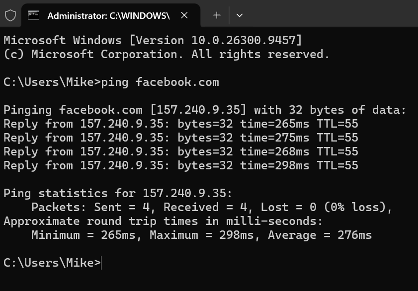
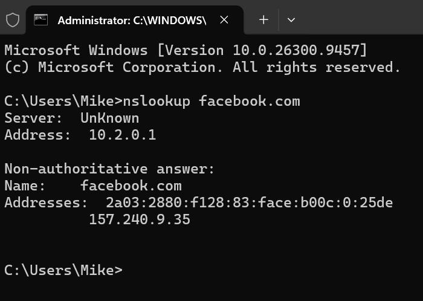
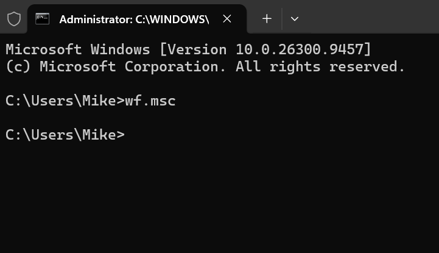
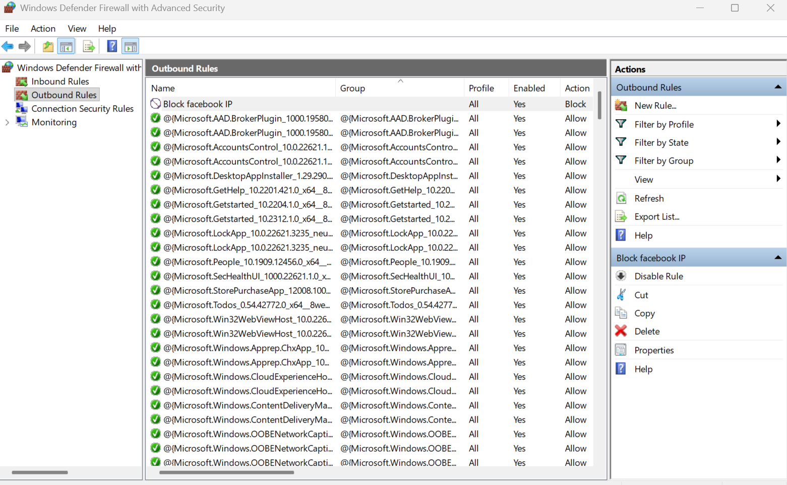
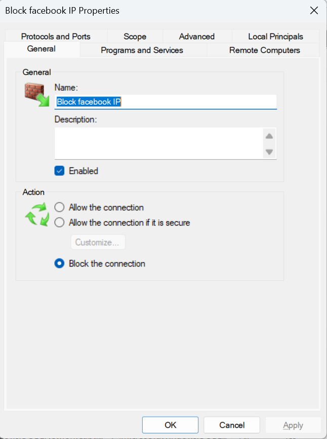
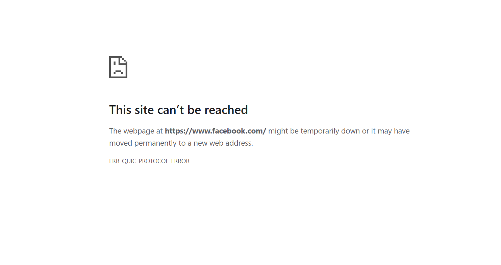
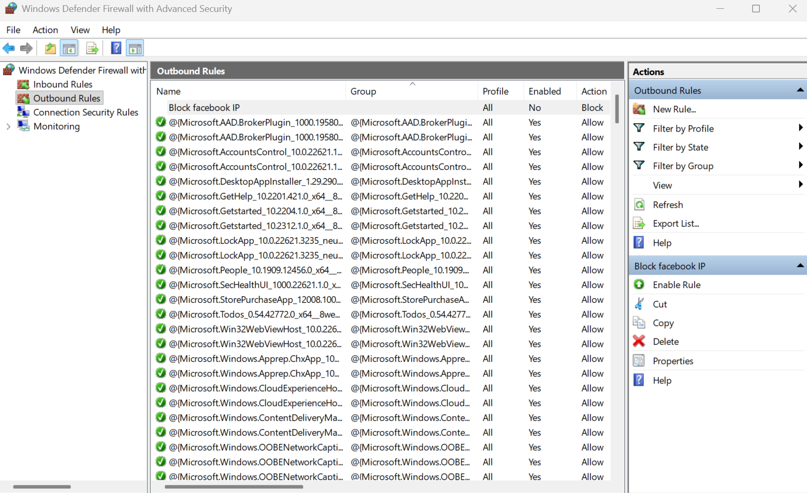

# Windows Firewall IP Blocking

A Windows Firewall lab demonstrating IP-based website blocking using Windows Defender Firewall with Advanced Security.

## Project Overview

This project demonstrates how to use Windows Defender Firewall with Advanced Security to create an outbound firewall rule that blocks network traffic to a specific IPv4 address.

For this lab, I used Facebook (`facebook.com`) as the example website. I resolved the domain name to an IP address using `ping` and `nslookup`, created an outbound firewall rule to block traffic to the selected IP address, and tested website connectivity before blocking, after enabling the rule, and after disabling it.

The purpose of this project is to understand how IP-based firewall blocking works and why blocking an IP address is not necessarily the same as blocking an entire website.

## Objectives

The objectives of this lab were to:

- Resolve a website domain name to an IPv4 address.
- Understand Domain Name System (DNS) resolution.
- Identify an IPv4 address associated with a website.
- Create an outbound Windows Firewall rule.
- Block traffic to a specific remote IP address.
- Test connectivity before and after blocking.
- Disable the firewall rule and test connectivity again.
- Understand the limitations of IP-based website blocking.
- Explore why large websites use multiple IP addresses and distributed infrastructure.

## Lab Environment

- **Operating System:** Windows 10/11
- **Firewall:** Windows Defender Firewall with Advanced Security
- **Target Website:** Facebook (`facebook.com`)
- **Firewall Direction:** Outbound
- **Rule Type:** IP-based blocking

## 1. DNS Resolution and Finding the IP Address

The first step was to determine which IP address was associated with `facebook.com`.

I opened Windows Command Prompt and ran:

```cmd
ping facebook.com
```

I also used:

```cmd
nslookup facebook.com
```

The Domain Name System (DNS) translates human-readable domain names, such as `facebook.com`, into IP addresses that computers use to communicate across networks.

The IPv4 address returned during the lookup was used as the remote IP address for the Windows Firewall rule.

**Screenshot 1a — IP Address Resolution Using Ping**



This screenshot shows the domain name and the IPv4 address returned by the `ping` command.

**Screenshot 1b — IP Address Resolution Using Nslookup**



This screenshot shows the DNS lookup information returned by the `nslookup` command.

## 2. Testing the Website Before Blocking

Before creating the firewall rule, I tested whether Facebook was accessible from my Windows computer.

I opened:

https://www.facebook.com

This established a baseline for comparing the website's behavior before and after the firewall rule was enabled.

**Screenshot 2 — Facebook Before Blocking**


This screenshot provides evidence of Facebook's accessibility before the firewall rule was enabled.

## 3. Creating the Windows Firewall Outbound Rule

I opened Windows Defender Firewall with Advanced Security by running:

```cmd
wf.msc
```

**Screenshot 3 — Opening Windows Defender Firewall with Advanced Security**

 


I then navigated to:

**Outbound Rules → New Rule**

I created an outbound firewall rule and specified the IPv4 address obtained during the DNS resolution step. The rule was configured to apply to outbound traffic destined for the selected remote IP address.

**Screenshot 4 — Firewall Rule Creation**



This screenshot shows the Windows Defender Firewall with Advanced Security console used to configure the outbound rule.

## 4. Configuring the Rule to Block the Connection

I configured the firewall rule with the action:

**Block the connection**

This instructs Windows Firewall to block network traffic matching the rule's conditions from reaching the specified remote IP address.

**Screenshot 5 — Firewall Rule Properties**



This screenshot provides evidence of the rule's blocking configuration.

## 5. Testing After Enabling the Firewall Rule

After creating and enabling the firewall rule, I attempted to access Facebook again to determine whether blocking the selected IP address affected connectivity.

**Test result:** During my test, Facebook became inaccessible after the firewall rule was enabled.

However, blocking one IP address does not necessarily make an entire website permanently inaccessible. Large websites may use multiple IP addresses and distributed network infrastructure.

**Screenshot 6 — Website After Blocking**



This screenshot shows the website's behavior after the firewall rule was enabled.

## 6. Disabling the Firewall Rule

After completing the blocking test, I disabled the firewall rule instead of deleting it. This preserved the configuration while preventing the disabled rule from actively blocking matching traffic.

I then tested access to Facebook again to observe whether connectivity was restored.

**Screenshot 7 — Website After Disabling the Rule**



This screenshot shows the website's behavior after the firewall rule was disabled.

## 7. What I Learned

### DNS Resolution

DNS stands for Domain Name System. It allows users to access websites through domain names rather than memorizing numerical IP addresses.

For example:

`facebook.com → DNS resolution → IP address`

The `ping` and `nslookup` commands helped me identify IP addresses associated with the domain.

### IPv4 Addresses

An IPv4 address is a numerical address used to identify a network interface or endpoint using the IPv4 protocol. It consists of four numerical sections separated by periods.

Example: `192.0.2.1`

The IP address used in this lab was obtained from my own DNS lookup.

### Outbound Network Traffic

Outbound traffic is network traffic leaving a computer. Windows Defender Firewall can apply rules to outbound connections.

In this lab, I created an outbound rule that matched traffic destined for a particular remote IP address. This demonstrated how a firewall can control communication between a computer and an external network destination.

### Windows Defender Firewall

Windows Defender Firewall is a host-based firewall included with Windows. It can use rules to allow or block network traffic based on characteristics such as:

- Program
- Protocol
- Local port
- Remote port
- Local IP address
- Remote IP address
- Network profile

In this project, I used a remote IP address as the primary condition for the blocking rule.

### Firewall Rules

A firewall rule defines how the firewall handles network traffic that matches specified conditions.

The basic concept demonstrated in this lab was:

`Computer → Outbound traffic → Firewall rule → Block matching traffic`

When the rule was disabled, that rule no longer actively blocked matching traffic.

## 8. IP Blocking vs. Domain Blocking

One of the most important lessons from this project is that blocking an IP address is not the same as blocking a domain name.

The firewall rule targeted a specific IP address rather than the text `facebook.com`.

The process can be represented as:

`facebook.com → DNS resolution → IP address → Firewall rule → Block matching traffic`

The firewall blocks traffic matching the selected IP address and other rule conditions. It does not necessarily block every IP address associated with Facebook.

## 9. Multiple IP Addresses and Distributed Infrastructure

Large websites such as Facebook use distributed network infrastructure. A domain may resolve to multiple IP addresses, and DNS results can vary depending on factors such as location, DNS resolver, network configuration, and service infrastructure.

Large websites may also use content delivery networks (CDNs) and other distributed systems to improve performance, availability, and scalability.

Because of this, blocking one IP address may not completely block access to a website.

For example:

```text
             facebook.com
                   |
          +--------+--------+
          |        |        |
         IP A     IP B     IP C
          |        |        |
       Blocked   Allowed  Allowed
```

If only IP A is blocked, connections using IP B or IP C may still succeed, provided no other rule blocks them.

## 10. Limitations of IP-Based Blocking

This lab demonstrated several limitations of IP-based blocking.

1. **Multiple IP addresses:** Blocking one address does not necessarily block all addresses associated with a domain.

2. **Changing DNS results:** The IP address returned for a domain can change over time, potentially making a rule based on an earlier lookup less effective.

3. **Shared infrastructure:** Multiple services or websites may share an IP address. Blocking it could unintentionally affect other services.

4. **Distributed infrastructure:** Modern websites may operate across many servers and locations, making single-IP blocking incomplete.

5. **No inherent domain awareness:** A basic IP-based firewall rule matches network traffic against its configured conditions. It does not inherently identify and block every connection associated with a particular domain name.

## 11. Conclusion

This project demonstrated how Windows Defender Firewall can be used to create an outbound rule that blocks traffic to a specific IPv4 address.

During the lab, I learned how to:

- Use `ping` and `nslookup` to investigate DNS resolution.
- Identify an IPv4 address associated with a domain.
- Create an outbound Windows Firewall rule.
- Configure a rule to block traffic to a remote IP address.
- Test connectivity before and after applying the rule.
- Disable the firewall rule and test connectivity again.
- Understand the differences between IP-based blocking and domain-based filtering.

The most important lesson is that blocking an IP address does not necessarily block an entire website. Modern websites may use multiple IP addresses and distributed infrastructure, so IP-based blocking can be incomplete.

This project provided practical experience with Windows Firewall configuration and demonstrated an important network security principle: the effectiveness of a firewall rule depends on the traffic it matches and the network infrastructure of the destination service.

## 12. Project Structure

The repository is organized as follows:

```text
windows-firewall-ip-blocking/
│
├── README.md
│
├── screenshots/
│   ├── 01a-ip-address-ping.png
│   ├── 01b-ip-address-nslookup.png
│   ├── 02-opening-windows-firewall-with-advanced-security.png
│   ├── 03-before-blocking.png
│   ├── 04-Block-Facebook-IP.png
│   ├── 05-rule-properties.png
│   ├── 06-after-blocking.png
│   └── 07-after-disabling-the-rule.png
│
└── notes/
    └── lab-notes.md
```

## Evidence

The screenshots in this repository provide visual evidence of the main stages of the lab, including:

- IP address resolution using `ping`.
- DNS resolution using `nslookup`.
- Website testing before blocking.
- Firewall rule creation.
- Firewall rule properties.
- Website testing after blocking.
- Website testing after disabling the rule.
